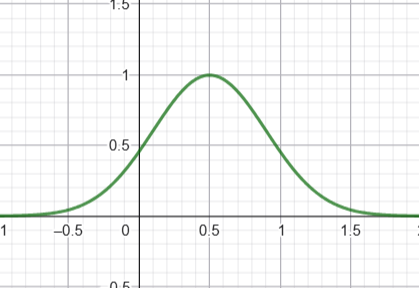
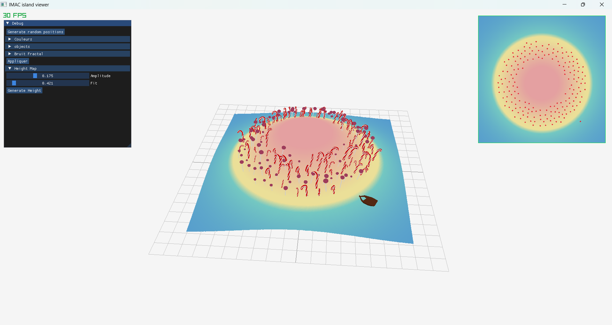
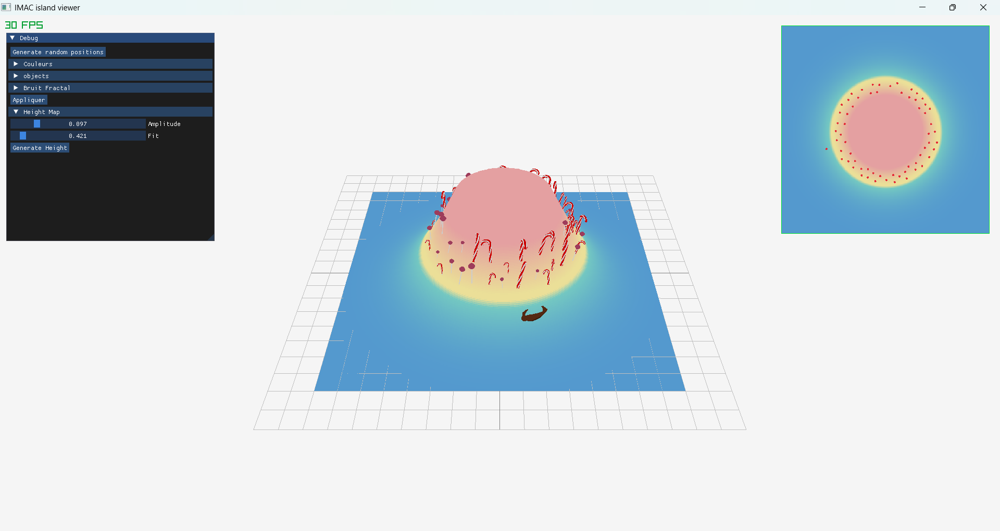
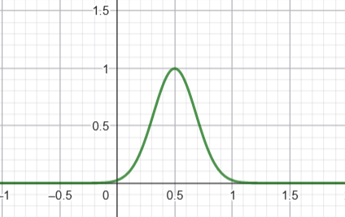
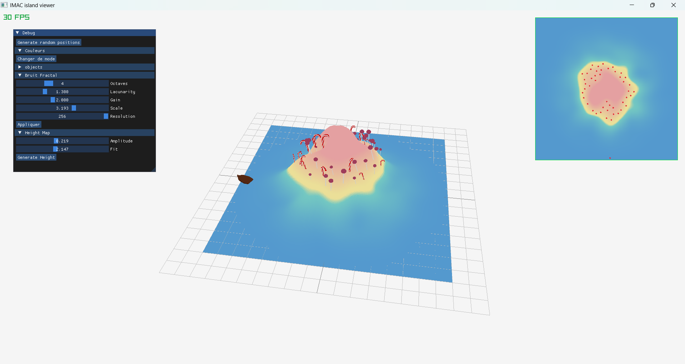
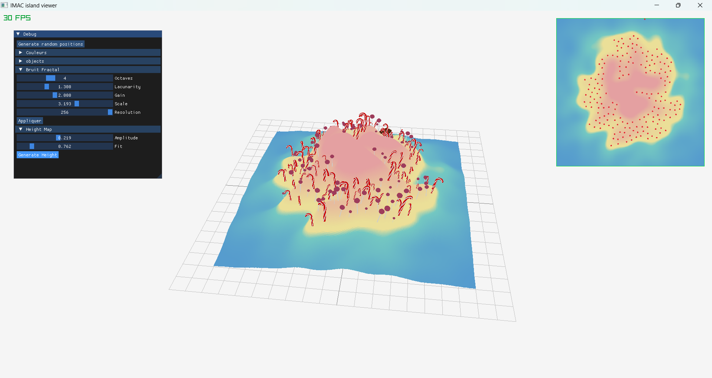

# L'île aux chiens

Le projet a été développé sous Windows.

## Fonctionnalités de base

### Bruit Fractal

Les paramètres pour gérer le bruit sont :

- Le nombre d'octaves
- La lacunarity
- Le gain
- L'échelle
- La résolution
<figure>
    
    <figcaption style="text-align: center;">Exemple de variation du bruit en fonction des paramètres 1</figcaption>
</figure>
<figure>
    
    <figcaption style="text-align: center;">Exemple de variation du bruit en fonction des paramètres 2</figcaption>
</figure>

### Génération de heightmap

Nous avons utilisé une fonction gaussienne pour effectuer un masque radial. Le but est d'obtenir une **zone d'élévation élevée au centre** et des **zones plus faibles** donc vers zéro **aux extrémités**. Ensuite, nous multiplions le masque à notre bruit fractal. Notre masque comprend deux paramètres :

- **l'amplitude** : gère la hauteur de l'île et son étendue.
- **un facteur Fit** : permet de **normaliser** les valeurs du masque entre 0 et 1

<figure style = "text-align: center">
    
    <figcaption style="text-align: center">Courbe d'une fonction Gaussienne sans le paramètre `Fit`</figcaption>
</figure>

Observons l'allure de l'île avec le **masque radial appliqué** (sans le bruit) :

<figure>
    
    <figcaption style="text-align: center">Amplitude élevée = île plate et plus étendue</figcaption>
</figure>

<figure>
    
    <figcaption style="text-align: center">Amplitude faible = île plus haute et moins étendue</figcaption>
</figure>

Ensuite, nous avons trouvé un moyen de **normaliser nos valeurs** de notre masque pour qu'elles soient comprises entre 0 et 1. Il a fallu modifier légèrement la fonction gaussienne en ajoutant un facteur appelé `fit` qui permet de contraindre notre courbe entre **0 et 1**. L'île devient plus ou moins **étroite** tout en gardant son amplitude. Un autre impact visuel lié à ce facteur est la quantité d'eau autour de l'île. 
Observons l'allure de l'île avec le **masque radial appliqué** et multiplié par le bruit fractal.

<figure style = "text-align: center">
    
    <figcaption style="text-align: center">Normalisation</figcaption>
</figure>

<figure>
    
    <figcaption style="text-align: center">Facteur Fit élevé = L'île est plus étroite</figcaption>
</figure>

<figure>
    
    <figcaption style="text-align: center">Facteur Fit faible = L'île est plus large, moins d'eau autour de l'ile</figcaption>
</figure>

### Couleurs en fonction de la hauteur (interpolation linéaire)

Nous avons fait le choix de faire une fonction à part (`calculateColors`) pour gérer les couleurs en fonction de la hauteur, pour un code plus lisible.

<figure>
    
    <figcaption style="text-align: center">Avant</figcaption>
</figure>
<figure>
    
    <figcaption style="text-align: center">Après</figcaption>
</figure>

La fonction d'interpolation (`interpolateVec`) est également séparée.

### Poisson Disk Sampling

Le code rédigé pour le PDS est largement basé sur [le code de Sebastian Lague](https://github.com/SebLague/Poisson-Disc-Sampling/blob/master/Poisson%20Disc%20Sampling%20E01/PoissonDiscSampling.cs).

### Placement des objets sur le terrain

Deux conditions sont mises en place : la hauteur du point doit être supérieure à 0.4 et inférieure à 0.7. Sinon, le point n'est pas ajoutée à la liste de points à placer.

## Améliorations

### "Mode" de l'île

2 modes sont disponibles pour changer l'aspect de l'île : un mode sombre et un mode clair. Sur l'interface, un bouton permet de changer de mode. Ci-dessous se trouvent les paramètres modifiés en fonction de celui-ci.

### Placement amélioré

Différents types d'arbres apparaissent sur l'île à la place des cubes (entre 0.4 et 0.7), en fonction du mode courrant (des arbres morts pour le sombre, des bonbons pour le mode clair).
Au lieu de stocker un tableau de positions pour placer les objets, nous stockons un tableau de `ObjectParams`, une stucture personnalisée contenant la positions de l'objet, sa scale, sa rotation et sa **Nature**. Cette structure permet de donner un angle et une échelle aléatoires à chaque objet (pour plus de réalisme). La `Nature` est un `enum` permettant de "typer" les objets (par exemple, les arbres morts ont la Nature `WINTER_TREE1` et `WINTER_TREE2`), pour charger les bons modèles 3D, notamment au changement de mode.

D'autres objets que les arbres sont placés : un bateau, placé aléatoirement en dessous du niveau 0.3 (fonction `generateBoat` dans `generation.cpp` ), et un phare, placé au point le plus haut de l'île (fonction `generateLightHouse` dans `generation.cpp`).

### Couleurs

Les couleurs sont gérées grâce à la `struct Colors` dans `app.hpp`. Elle contient les valeurs rgb des couleurs, un booléen indiquant si l'île est en mode clair ou sombre, et deux fonctions (une permettant de passer au mode clair, l'autre au mode sombre).
Les deux fonctions changent la valeur du booléen et les valeurs rgb des couleurs.

## Analyse du travail effectué

### Dificultés

#### Modification de la fonction `TransformImage`

La fonction `calculateColors` a besoin de la `struct Colors`. Nous avons donc dû modifier la fonction `TransformImage` dans `raylibUtils.hpp` pour qu'elle accepte un autre type en paramètres. Ce n'était pas évident car la notion de template ne nous était pas familière.

#### Normalisation du masque

Pour que les valeurs soient comprises entre 0 et 1, nous étions tentées d'utiliser un `clamp` afin de rester dans cet interval. Le problème que nous avons recontré était que la pente de notre masque était très brute. La difficulté était de trouver mathématiquement où allait se placer notre facteur `Fit` dans la formule, alors il a fallu y a aller à tatonnement jusqu'à obtenir l'effet voulu. Un peu plus d'intuition mathématique nous aurait permis de gagner du temps.

#### Import d'objet 3D réalisé sur Blender

Petit problème de texture découvert après export : les phares sont tout blanc. On a expérimenté plusieurs formats d'exports pour voir lequel fonctionnait le mieux. Au final, le format glb permet de bien transférer les textures.

### Répartition du travail

Nous avons pu facilement nous coordonner afin de se répartir les tâches efficacement. Nous avons commencé à étudier le projet ensemble afin de s'assurer de bien comprendre les consignes et de s'aligner sur la vision globale du projet. Ensuite nous nous sommes partagé les étapes afin que chacune puisse travailler de son côté, nous nous tenions également au courant de chaque avancée du code et en cas de blocage ou de difficulté nous en discutions pour trouver des solutions. Une fois les fonctions de bases créées, nous avons pris la liberté de discuter ensemble de l'aspect esthétique et original de notre île afin de créer un univers propre à notre travail. Et de là, on s'est amusée à créer et à ajouter des objets 3D en suivant nos thèmes.

### Avec plus de temps ?

Une de nos idées était de faire en sorte que chaque mode de l'île (clair, sombre) ait **sa propre forme de masque**. Si le temps nous le permettait, nous aurions aimé faire un masque en forme d'étoile pour l'île en mode clair pour aller au bout de l'aspect "mignon" de l'île.

Une autre idée était de transitionner du mode sombre au clair et inversement, notamment au niveau des couleurs. Dans la version actuelle, le changement est très brut, avec un simple bouton. Nous avions imaginé un slider permettant de choisir à quel point l'île était sombre ou clair.
