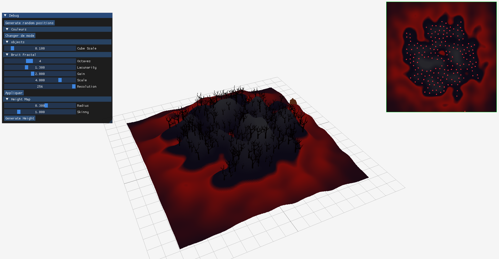
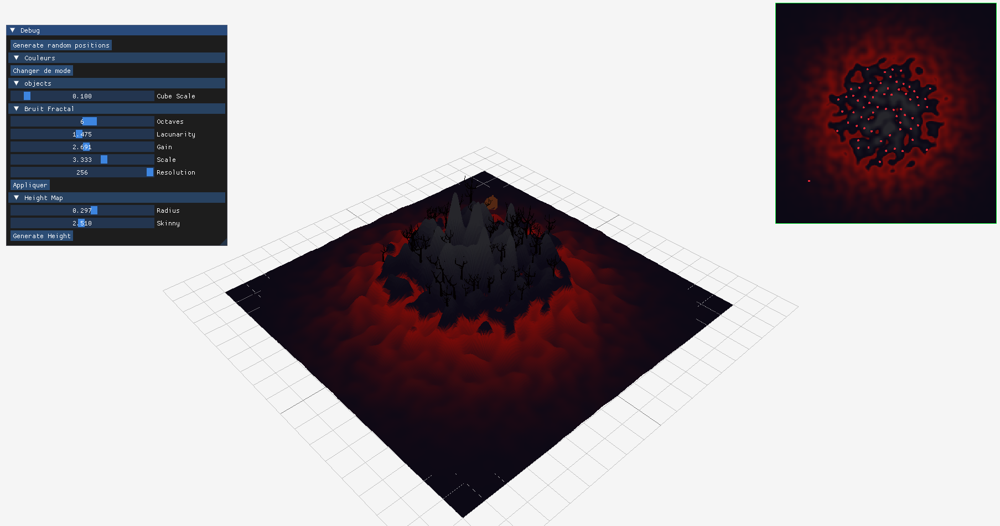
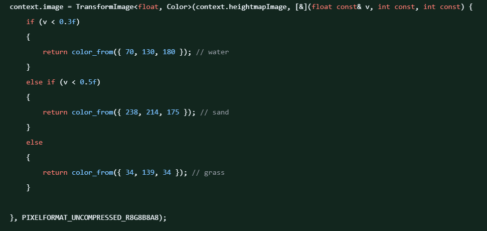
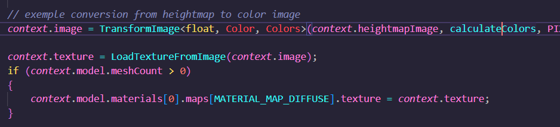

# L'île aux chiens

Le projet a été développé sous Windows.

## Fonctionnalités de base

### Bruit Fractal
Les paramètres pour gérer le bruit sont :
- Le nombre d'octaves
- La lacunarity
- Le gain
- L'échelle
- La résolution
<figure>
    
    <figcaption style="text-align: center;">Exemple de variation du bruit en fonction des paramètres 1</figcaption>
</figure>
<figure>
    
    <figcaption style="text-align: center;">Exemple de variation du bruit en fonction des paramètres 2</figcaption>
</figure>

### Génération de heightmap
### Couleurs en fonction de la hauteur (interpolation linéaire)
Nous avons fait le choix de faire une fonction à part (`calculateColors`) pour gérer les couleurs en fonction de la hauteur, pour un code plus lisible.
<figure>
    
    <figcaption style="text-align: center">Avant</figcaption>
</figure>
<figure>
    
    <figcaption style="text-align: center">Après</figcaption>
</figure>

La fonction d'interpolation (`interpolateVec`) est également séparée.

### Poisson Disk Sampling
Le code rédigé pour le PDS est largement basé sur [le code de Sebastian Lague](https://github.com/SebLague/Poisson-Disc-Sampling/blob/master/Poisson%20Disc%20Sampling%20E01/PoissonDiscSampling.cs).

### Placement des objets sur le terrain
Deux conditions sont mises en place : la hauteur du point doit être supérieure à 0.4 et inférieure à 0.7. Sinon, le point n'est pas ajoutée à la liste de points à placer.

## Améliorations
### Placement des objets sur le terrain
### Couleurs
Les couleurs sont gérées grâce à la `struct Colors` dans `app.hpp`. Elle contient les valeurs rgb des couleurs, un booléen indiquant si l'île est en mode "clair" ou "sombre", et deux fonctions (une permettant de passer au mode clair, l'autre au mode sombre).
Les deux fonctions changent la valeur du booléen et les valeurs rgb des couleurs.

Sur l'interface, un bouton permet de changer de mode (il appelle les fonctions de la `struct Colors` donc).

#### Dificultés